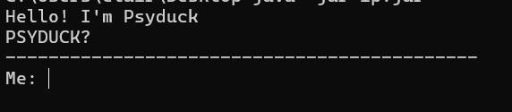

# PSYDUCKKK - User Guide

Psyduck is a command-line Task Tracker designed to help users efficiently track and manage their **todos**, **deadlines** and **events**.

---
## Quick Start
1. Ensure you have Java 17 installed in your Computer
2. Download the latest release (`ip.jar`) from [here](https://github.com/clj55/ip/releases/download/A-Release/ip.jar).
3. Copy the file to the folder you want to store your tasks in. A PsyduckData folder will be **automatically created** in this folder containing the text file for data storage after you run the application.
4. Open a command terminal, `cd` into the folder you put the `ip.jar` file in and use enter `java -jar ip.jar` command to run the application.
5. If successful, Psyduck will greet you!

6. Type the command in the command line and press Enter.
7. Refer to [Commands](https://clj55.github.io/ip/#commands) below for more details.

## Command Summary

| Command    | Description                        | Format                    | Example                                     |
| ---------- |------------------------------------|---------------------------|---------------------------------------------|
| `bye`      | Exits the program                  | bye                       | `bye`                                       |
| `list`     | Lists all tasks                    | list                      | `list`                                      |
| `todo`     | Adds a to-do task                  | todo TASK_NAME            | `todo feed Psyducklings`                    |
| `deadline` | Adds a deadline task               | deadline TASK_NAME /BY    | `deadline Heal /4PM`                        |
| `event`    | Adds an event task                 | event TASK_NAME /FROM /TO | `event Pokebattle /20-03-2025 /to 22 March` |
| `delete`   | Deletes a task                     | delete TASK_NUMBER        | `delete 2`                                  |
| `mark`     | Marks a task as completed          | mark TASK_NUMBER          | `mark 3`                                    |
| `unmark`   | Marks a task as not completed      | unmark TASK_NUMBER        | `unmark 1`                                  |
| `find`     | Finds tasks by keyword in the name | find KEYWORD              | `find p`                                    |

---

## Commands

<strong> Notes about the Command Format </strong>
   
   

- Words in `UPPER_CASE` are the parameters to be supplied by the user.
    e.g. in `todo /TASK_NAME`, `TASK_NAME` is a parameter to be replaced with the name of the task such as `todo CS2113 ip`
   
   

- Parameters <strong> must </strong> be in the specified order.
   e.g. in `deadline TASK_NAME /BY' TASK_NAME should come before BY, swapping the 2 parameters will cause errors
   
   

- Extraneous parameters for commands that do not take in parameters (such as `list` and `bye`) will cause errors.
  e.g. Psyduck will not understand `bye sdf` and reply with `Nani??`
   
   

- If you are using a PDF version of this document, be careful when copying and pasting commands that span multiple lines as space characters surrounding line-breaks may be omitted when copied over to the application.
   

---

### List of Commands

---

### **Exiting the program:** `bye`

**Description:** Exits the program.

- **Format:** `bye`

### **Display all Tasks:** `list`

**Description:** Displays all the tasks in the list.

- **Format:** `list`

### **Create new Todo:** `todo`

**Description:** Adds a new todo to the list

- **Format:** `todo TASK_NAME`
- **Note**: Extraneous spaces before `TASK_NAME` will be trimmed
- **Example:** `todo Catch Pickachu` and <code>todo `      `Catch Pickachu</code> will both add the Todo "Catch Pickachu"

### **Create new deadline:** `deadline`

**Description:** Adds a new deadline to the list

- **Format:** `deadline TASK_NAME /BY`
- `BY` refers to when you need to finish the deadline by
- **Note**: Extraneous spaces before `TASK_NAME` will be trimmed
- **Examples:** `deadline Beat Team Rocket /14 March 2359` will add a deadline "Beat Team Rocket" to be done by "14 March 2359"

### **Create new event:** `event`

**Description:** Adds a new event to the list

- **Format:** `event TASK_NAME /FROM /TO`
- `FROM` refers to when the event starts
- `TO` refers to when the event ends
- **Note**: Extraneous spaces before `TASK_NAME` will be trimmed
- **Examples**: `event Pokebattle /Today 3pm /4pm` will add an event "Pokebattle" starting from "Today 3pm" to "4pm"

### **Delete a Task:** `delete`

**Description:** Deletes the task corresponding to the `TASK_NUMBER` specified from the list

- **Format:** `delete TASK_NUMBER`
- **Note**: `TASK_NUMBER` must be specified as a digit
- **Examples:** `delete 2` will delete the 2nd task from the list
- **Tip:** use `list` to see the task numbers in the list before deleting

### **Mark a task as complete:** `mark`

**Description:** Marks a task as completed.

- **Format:** `mark TASK_NUMBER`
- **Note**: `TASK_NUMBER` must be specified as a digit
- **Examples:** `mark 2` marks the 2nd task in the list as complete

### **Mark a task as not complete:** `unmark`

**Description:** Marks a task as not completed.

- **Format:** `unmark TASK_NUMBER`
- **Note**: `TASK_NUMBER` must be specified as a digit
- **Examples:** `unmark 2` marks the 2nd task in the list as not complete

### **Find a task:** `find`

**Description:** Finds tasks containing the keyword in its Name.

- **Format:** `find KEYWORD`
- **Note:** will find all occurrences of `KEYWORD` no matter where it is in the Task Name. Extra spaces before `KEYWORD` will be trimmed  
- **Example:** "caterpillar" will be found when `find cat` is executed 
- **Example:** "cat bowl" will be found when <code>find`   `cat bowl</code> is executed but not "cat"

### **Saving your data**

Psyduck's `TaskList` will be saved automatically after every command.
There is no need to save manually.

### **Editing Saved data**

BobChungus' `TaskList` Data is automatically saved as a `.txt` file at `[JAR file location]/PsyduckData/tasks.txt`. Advanced users are welcome to update data directly by editing that data file.

  <strong>Caution:</strong>  If your changes to the data file makes its format invalid, Psyduck will discard the erroneous line of data. Hence, it is recommended to take a backup of the file before editing it.
 
 
Blank Lines between tasks will be removed by Psyduck.
 
 
Furthermore, certain edits can cause Psyduck to behave in unexpected ways (e.g., if a value entered is outside of the acceptable range). Therefore, edit the data file only if you are confident that you can update it correctly.

---

## FAQs

### 1. **What happens if I enter an invalid command?**

- Psyduck will reply with `Nani??`

### 2. **What if I forget to include the arguments for a command like `todo` or `deadline`?**

- Psyduck will reply with the correct format as long as the command word is correct.

### 3. **What format should the dates be in?**

- It can be in any format you want

---

## Known Issues

- Adding extraneous `/` when adding tasks will be accepted by the program. However, when the program is closed and reopened again, the task will be removed when loading the data from the Task File